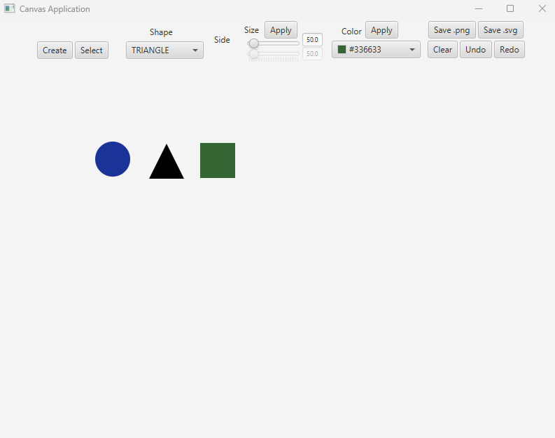

# JavaFX Draw Application
Assignment for course in Java Programming
***
## Description
Simple JavaFX application with a graphical interface for drawing shapes using MVC structure (Model, View Controller).
Tests included are written with Junit5.

## Features

* Create triangle, circle and rectangle shapes
* Colorpicker
* Change size
* Selection
* Undo & redo commands
* Save image
* Tests
***

